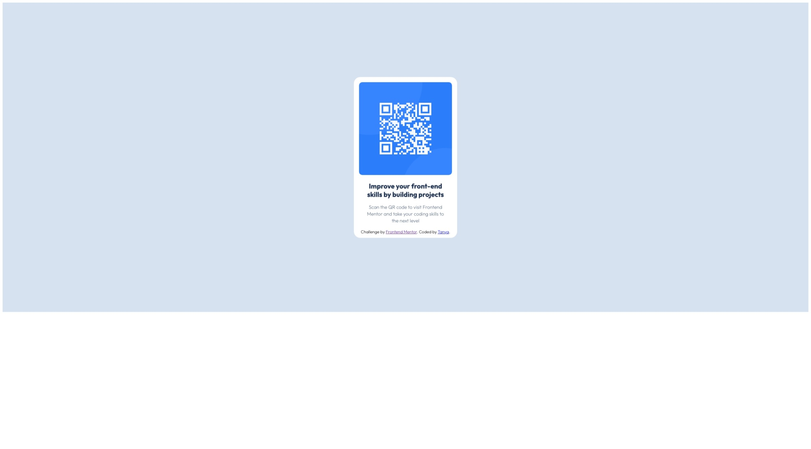

# Frontend Mentor - QR code component solution

This is a solution to the [QR code component challenge on Frontend Mentor](https://www.frontendmentor.io/challenges/qr-code-component-iux_sIO_H). Frontend Mentor challenges help you improve your coding skills by building realistic projects. 

## Table of contents

- [Overview](#overview)
  - [Screenshot](#screenshot)
  - [Links](#links)
- [My process](#my-process)
  - [Built with](#built-with)
  - [What I learned](#what-i-learned)
  - [Continued development](#continued-development)
  - [Useful resources](#useful-resources)
- [Author](#author)

## Overview

### Screenshot




### Links

- Solution URL: [Add solution URL here](https://your-solution-url.com)
- Live Site URL: [Add live site URL here](https://your-live-site-url.com)

## My process

### Built with

- Semantic HTML5 markup
- CSS custom properties
- Custom font [Outfit](https://fonts.google.com/specimen/Outfit)
- Flexbox
- Mobile-first workflow

### What I learned

I leaned how to add custom fonts and use them on the site

```css
@font-face {
    font-family: googleOutfit;
    src: url(./fonts/Outfit/Outfit-VariableFont_wght.ttf)
}

.attribution {
    font-family: googleOutfit;
}
```

### Continued development

I will continue focusing on modern HTML/CSS techniques and practical usage of them

### Useful resources

- [Flexbox] (https://www.w3schools.com/csS/css3_flexbox.asp) - This helped me to refresh knowledge about syntax of flexbox and arrange items of the page
- [GitHub Docs](https://docs.github.com/en/authentication/connecting-to-github-with-ssh/generating-a-new-ssh-key-and-adding-it-to-the-ssh-agent) - This helped me to conigure SSH keys for the project
- [Figma Learn](https://help.figma.com/hc/en-us/categories/360002051613) - This helped me to learn about Figma and how to use it

## Author

- Frontend Mentor - [@tmelnychenko](https://www.frontendmentor.io/profile/tmelnychenko)